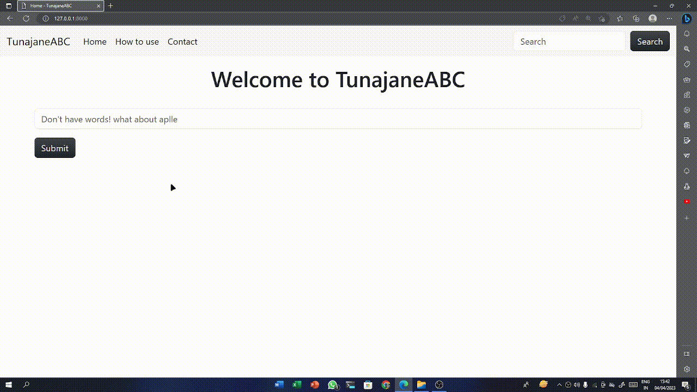

# Spell Checkor

This is a website made in django and it corrects the wrong spellings


## Run this app

To run this project you need to run these commands one by one

```bash
  pip3 install -r requirements.txt
```

### On Windows

```bash
  python manage.py makemigrations
  python manage.py migrate
```

### On Linux or MacOS

```bash
  python3 manage.py makemigrations
  python3 manage.py migrate
```

### Run the server using this command for Windows

```bash
  python manage.py runserver
```

### Run the server using this command for Linux or MacOS

```bash
  python3 manage.py runserver
```
## Code and Language

 * [Django](https://www.djangoproject.com/)
 * [TailwindCSS](https://tailwindcss.com/)
 * [Textblob](https://textblob.readthedocs.io/en/dev/)


## Welcome to TunajaneABC

**It means that *you don't now ABC***


Correct your wrong spell words in the best way using TunajaneABC
## Demo
**Here is the basic demo of this app**




# Thank You for Checking this repo